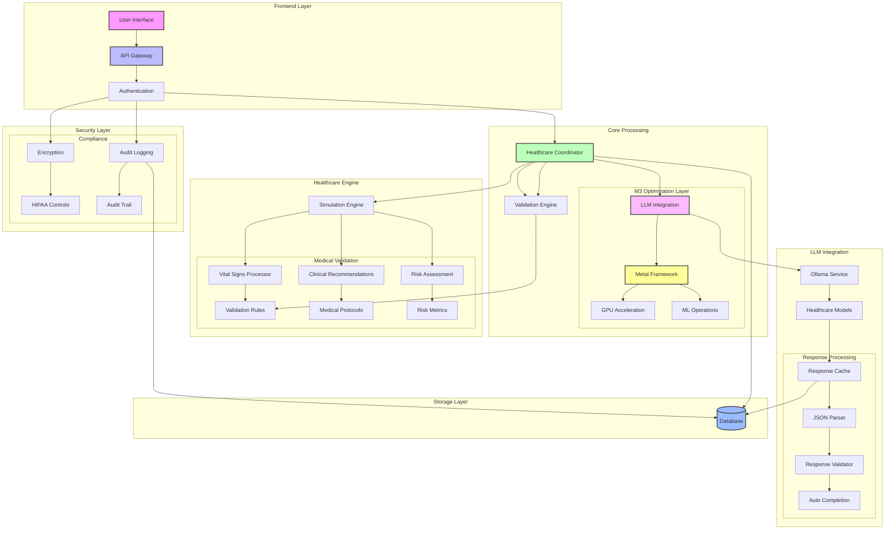
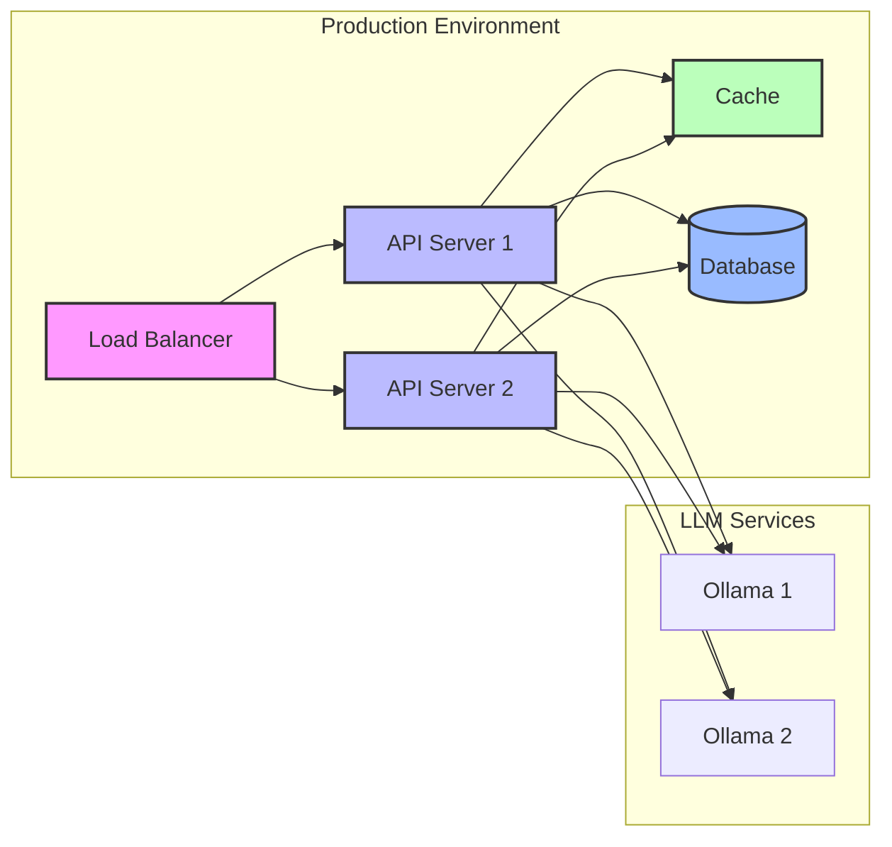

# Healthcare Simulation API Architecture

## System Architecture Overview

## Component Details

### Frontend Layer
- **User Interface**: Web-based interface for healthcare simulations
- **API Gateway**: FastAPI-based gateway with OpenAPI documentation
- **Authentication**: API key validation and request authorization

### Core Processing
- **Healthcare Coordinator**: Central orchestrator for medical simulations
- **LLM Integration**: Integration with Ollama and other LLM services
- **Validation Engine**: Input and output validation with medical rules

### M3 Optimization Layer
- **Metal Framework**: Apple Metal integration for GPU acceleration
- **GPU Acceleration**: Optimized ML operations using M3 GPU
- **ML Operations**: Efficient model inference and processing

### Healthcare Engine
- **Simulation Engine**: Medical scenario simulation processor
- **Vital Signs Processor**: Analysis of patient vital signs
- **Clinical Recommendations**: Evidence-based medical advice
- **Risk Assessment**: Patient risk evaluation system

### LLM Integration
- **Ollama Service**: Local LLM service for medical analysis
- **Healthcare Models**: Specialized medical language models
- **Response Cache**: Efficient caching of LLM responses
- **JSON Parser**: Robust JSON response handling
- **Response Validator**: Medical response validation
- **Auto Completion**: Partial response completion logic

### Security Layer
- **Encryption**: Data encryption at rest and in transit
- **Audit Logging**: Comprehensive security audit trail
- **HIPAA Controls**: Healthcare compliance measures
- **Audit Trail**: Detailed activity logging

### Storage Layer
- **Database**: PostgreSQL database for persistent storage
- **Cache**: In-memory cache for frequent operations

## Implementation Status

### Completed (✅)
- API Gateway implementation
- Authentication system
- M3 optimization
- Basic healthcare operations
- JSON response handling
- Security controls

### In Progress (⏳)
- Enhanced LLM integration
- Advanced medical validation
- Comprehensive audit logging
- Healthcare simulation accuracy

### Planned (🔲)
- Real-time monitoring
- Advanced analytics
- Custom medical protocols
- Performance optimization

## Security Considerations

1. **Authentication**
   - API key validation
   - Request authorization
   - Session management

2. **Data Protection**
   - Encryption at rest
   - Encryption in transit
   - Secure data handling

3. **Compliance**
   - HIPAA compliance
   - Audit logging
   - Access control

4. **Error Handling**
   - Secure error messages
   - Input validation
   - Rate limiting

## Performance Optimization

1. **M3 Specific**
   - Metal framework integration
   - GPU acceleration
   - Efficient memory usage

2. **LLM Optimization**
   - Response caching
   - Batch processing
   - Model optimization

3. **Database**
   - Connection pooling
   - Query optimization
   - Efficient indexing

## Deployment Architecture

## Notes
- All diagrams are generated using Mermaid
- Component status is indicated using emoji markers
- Architecture follows HIPAA compliance guidelines
- Optimization is specific to M3 silicon architecture
