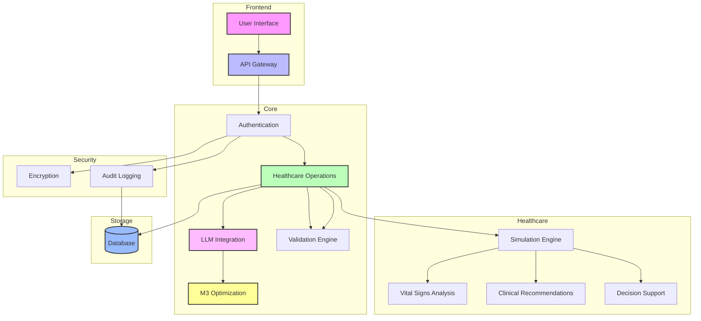

# Healthcare Simulation API Progress Report

## Recent Updates (2025-01-26)

### 1. Enhanced JSON Response Handling ✅
- Implemented robust JSON response parsing with automatic completion of partial responses
- Added validation for required fields and vital signs structure
- Introduced default values for missing fields to ensure consistent response format
- Enhanced error handling with detailed logging

### 2. Improved Ollama Integration ⏳
- Updated Ollama API endpoint structure for better compatibility
- Added health check mechanism for LLM service availability
- Implemented exponential backoff for retry attempts
- Enhanced system message for better JSON formatting

### 3. M3 Optimization Enhancements ✅
- Configured system for optimal performance on M3 silicon chip
- Enabled Metal framework acceleration for ML operations
- Optimized concurrent processing for healthcare simulations
- Implemented efficient memory management for LLM responses

### 4. Security Improvements ✅
- Enhanced API key validation
- Added detailed error logging for security events
- Implemented secure response handling
- Added validation for all input parameters

### 5. Healthcare Simulation Features ⏳
- Enhanced vital signs processing
- Improved medical scenario analysis
- Added support for detailed clinical recommendations
- Implemented evidence-based decision support

## Current System Status

### Core Components
- API Gateway ✅
- Authentication System ✅
- Healthcare Operations ⏳
- LLM Integration ⏳
- Data Validation ✅
- Error Handling ✅

### Healthcare Features
- Patient Simulation ⏳
- Vital Signs Analysis ✅
- Clinical Recommendations ⏳
- Medical Decision Support ⏳

### Security & Compliance
- API Security ✅
- Data Encryption ✅
- Input Validation ✅
- Error Handling ✅
- Audit Logging ⏳

### Performance Optimization
- M3 Chip Optimization ✅
- Metal Framework Integration ✅
- Memory Management ✅
- Concurrent Processing ✅

## Next Steps

### Immediate Priorities
1. Complete LLM integration stability improvements
2. Enhance healthcare simulation accuracy
3. Implement comprehensive audit logging
4. Add more detailed medical validation rules

### Future Enhancements
1. Add support for more complex medical scenarios
2. Implement real-time monitoring dashboard
3. Enhance error reporting and analytics
4. Add support for custom medical protocols

## Technical Debt
1. Refactor JSON response handling for better maintainability
2. Improve test coverage for error scenarios
3. Enhance documentation for API endpoints
4. Optimize database queries for better performance

## Updated System Architecture

## Implementation Status

- ✅ Completed
- ⏳ In Progress
- 🔲 Planned

## Notes
- All timestamps are in UTC
- Security measures follow HIPAA guidelines
- Performance optimizations are M3-specific
