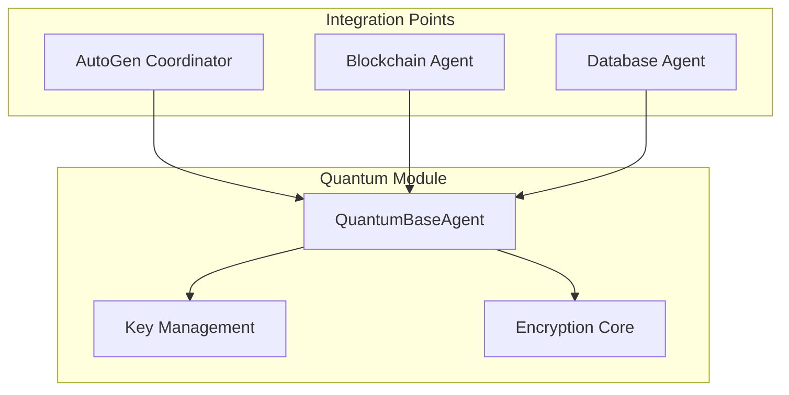
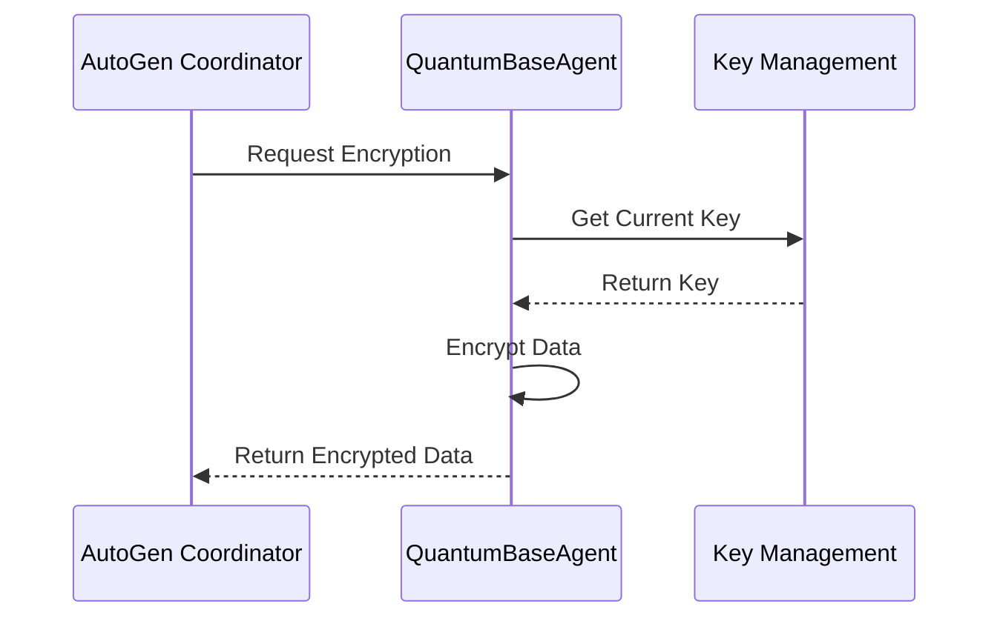

# Quantum Module Design Specification

## 1. Overview

### 1.1 Purpose
The Quantum Module provides quantum-resistant encryption capabilities for the IQHIS system, ensuring long-term security against quantum computing threats.

### 1.2 Scope
- Quantum-safe encryption for all data in transit and at rest
- Key management and rotation
- Integration with AutoGen components
- Compliance with healthcare regulations

## 2. Architecture

### 2.1 Component Diagram


### 2.2 Class Structure
```python
@dataclass
class EncryptionConfig:
    algorithm: str          # Quantum-safe algorithm selection
    key_rotation_hours: int # Key rotation frequency
    key_size: int          # Key size for the algorithm

class QuantumBaseAgent:
    def __init__(config_path: Optional[Path])
    async def encrypt_message(message: str) -> Dict[str, Any]
    async def decrypt_message(encrypted_data: Dict[str, Any]) -> str
    async def rotate_keys() -> bool
    def get_encryption_status() -> Dict[str, Any]
```

## 3. Security Features

### 3.1 Encryption Algorithms
- Primary: Kyber1024 (NIST PQC standard)
- Key Encapsulation Mechanism (KEM)
- Digital Signatures: Dilithium
- Symmetric Encryption: AES-256-GCM

### 3.2 Key Management
- Automatic key rotation (24-hour cycle)
- Secure key storage
- Key backup and recovery
- Audit logging of key operations

### 3.3 Security Controls
- Access control
- Audit logging
- Encryption at rest
- Encryption in transit

## 4. Integration Points

### 4.1 AutoGen Integration


### 4.2 Healthcare Compliance
- HIPAA compliance
- FDA requirements
- GDPR considerations
- Audit trail requirements

## 5. Performance Optimization

### 5.1 M3 Acceleration
- Hardware acceleration for encryption
- Parallel processing
- Optimized key generation
- Caching strategies

### 5.2 Performance Metrics
- Encryption latency: < 10ms
- Throughput: > 1000 ops/sec
- Key rotation: < 1s
- Memory usage: < 500MB

## 6. Error Handling

### 6.1 Error Types
- Configuration errors
- Encryption failures
- Key rotation issues
- Integration errors

### 6.2 Recovery Procedures
- Automatic fallback mechanisms
- Error reporting
- Incident logging
- Recovery protocols

## 7. Testing Strategy

### 7.1 Unit Tests
- Configuration validation
- Encryption/decryption
- Key management
- Error handling

### 7.2 Integration Tests
- AutoGen integration
- Performance testing
- Security testing
- Compliance validation

## 8. Deployment

### 8.1 Configuration
```yaml
quantum_agent:
  algorithm: "Kyber1024"
  key_rotation_hours: 24
  key_size: 1024
  security:
    audit_logging: true
    encryption_required: true
```

### 8.2 Dependencies
- liboqs-python>=0.9.0
- cryptography>=42.0.0
- pydantic>=2.0.0
- PyYAML>=6.0.1

## 9. Monitoring

### 9.1 Metrics
- Encryption operations
- Key rotations
- Error rates
- Performance metrics

### 9.2 Alerts
- Key rotation failures
- Performance degradation
- Security incidents
- Compliance violations

## 10. Documentation

### 10.1 API Documentation
- Interface specifications
- Usage examples
- Error handling
- Best practices

### 10.2 Operational Procedures
- Key rotation
- Incident response
- Backup procedures
- Recovery processes 