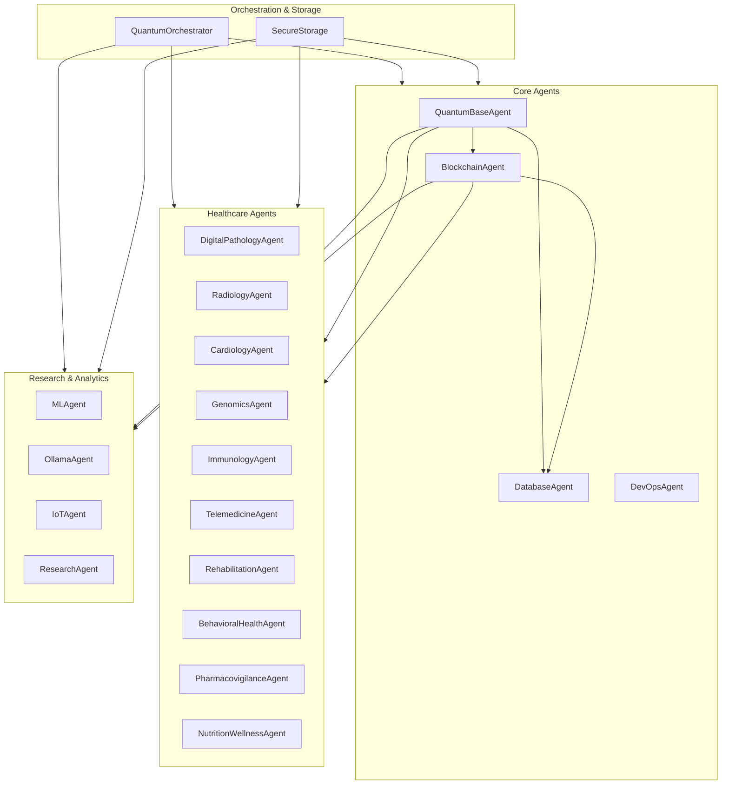

# Agent System Architecture

## Overview

The Integrated Quantum-Resistant Healthcare Information System (IQHIS) implements a microservices-based architecture using specialized agents. Each agent is designed with quantum-safe security, healthcare compliance requirements, and M3 performance optimizations in mind.

## System Architecture Diagram

## Core Agents

### 1. QuantumBaseAgent
- **Purpose**: Provides quantum-safe cryptographic operations
- **Key Features**:
  - Post-quantum cryptography (PQClean, liboqs)
  - Key encapsulation (Kyber, NewHope)
  - Digital signatures (Dilithium, SPHINCS+)
- **Implementation**: [QuantumBaseAgent Implementation](../implementations/quantum_base_agent.md)

### 2. BlockchainAgent
- **Purpose**: Manages distributed ledger operations
- **Key Features**:
  - IOTA Tangle integration (Hornet)
  - Transaction recording
  - Smart contract execution
- **Implementation**: [BlockchainAgent Implementation](../implementations/blockchain_agent.md)

### 3. DatabaseAgent
- **Purpose**: Handles data persistence and retrieval
- **Key Features**:
  - PostgreSQL/CockroachDB integration
  - Schema versioning
  - Quantum-safe backups
- **Implementation**: [DatabaseAgent Implementation](../implementations/database_agent.md)

### 4. DevOpsAgent
- **Purpose**: Manages infrastructure and deployments
- **Key Features**:
  - Infrastructure as Code (Terraform/Ansible)
  - CI/CD pipelines
  - Container orchestration
- **Implementation**: [DevOpsAgent Implementation](../implementations/devops_agent.md)

## Healthcare Agents

### 1. Imaging Agents
- **DigitalPathologyAgent**:
  - OpenSlide integration
  - MONAI for AI analysis
  - NFT minting capabilities
- **RadiologyAgent**:
  - DICOM processing
  - AI-based analysis
  - Secure image storage

### 2. Specialty Agents
- **CardiologyAgent**:
  - ECG/EKG analysis
  - Real-time monitoring
  - HL7/FHIR compliance
- **GenomicsAgent**:
  - Variant calling
  - Sequence analysis
  - Data privacy controls
- **ImmunologyAgent**:
  - Immunotherapy tracking
  - OMOP mapping
  - Research integration

### 3. Care Delivery Agents
- **TelemedicineAgent**:
  - WebRTC integration
  - Secure video/audio
  - Session management
- **RehabilitationAgent**:
  - Progress tracking
  - Exercise planning
  - Outcome monitoring
- **BehavioralHealthAgent**:
  - Session management
  - Progress tracking
  - Privacy controls

### 4. Support Agents
- **PharmacovigilanceAgent**:
  - Adverse event tracking
  - NLP analysis
  - Regulatory reporting
- **NutritionWellnessAgent**:
  - Diet tracking
  - Wellness metrics
  - Integration with IoT

## Research & Analytics Agents

### 1. ML/AI Agents
- **MLAgent**:
  - PyTorch/TensorFlow integration
  - M3 optimization
  - Model management
- **OllamaAgent**:
  - Local LLM integration
  - Privacy-preserving inference
  - Model fine-tuning

### 2. Data Collection Agents
- **IoTAgent**:
  - Device management
  - Data collection
  - Real-time processing
- **ResearchAgent**:
  - Protocol management
  - Data versioning
  - Analysis pipelines

## Security & Compliance

### 1. Security Measures
- Quantum-safe encryption
- Zero-trust architecture
- Secure communication channels

### 2. Compliance Features
- HIPAA compliance
- GDPR readiness
- FDA requirements
- ISO 13485/IEC 62304

### 3. Risk Management
- Continuous assessment
- Threat modeling
- Incident response

## Performance Optimization

### 1. M3 Acceleration
- Metal API integration
- GPU optimization
- Parallel processing

### 2. Scalability
- Horizontal scaling
- Load balancing
- Resource optimization

## Implementation Guidelines

### 1. Development Standards
- Clean architecture
- SOLID principles
- Test-driven development
- Documentation requirements

### 2. Technology Stack
- Languages: Python, TypeScript
- Frameworks: FastAPI, NestJS
- Storage: PostgreSQL, IOTA
- Queue: Kafka/RabbitMQ

### 3. Deployment
- Container orchestration
- Service mesh
- Monitoring/logging
- Backup/recovery

## Next Steps

1. [Core Agent Implementation](../implementations/core_agents.md)
2. [Healthcare Agent Implementation](../implementations/healthcare_agents.md)
3. [Analytics Agent Implementation](../implementations/analytics_agents.md)
4. [Security Implementation](../implementations/security.md)

## References

- [Design Controls](../design_controls/design_control_template.md)
- [Risk Management](../regulatory/risk_management.md)
- [Validation Framework](../validation/validation_framework.md)
- [CI/CD Pipeline](../tools/ci_cd/pipeline_template.yml) 