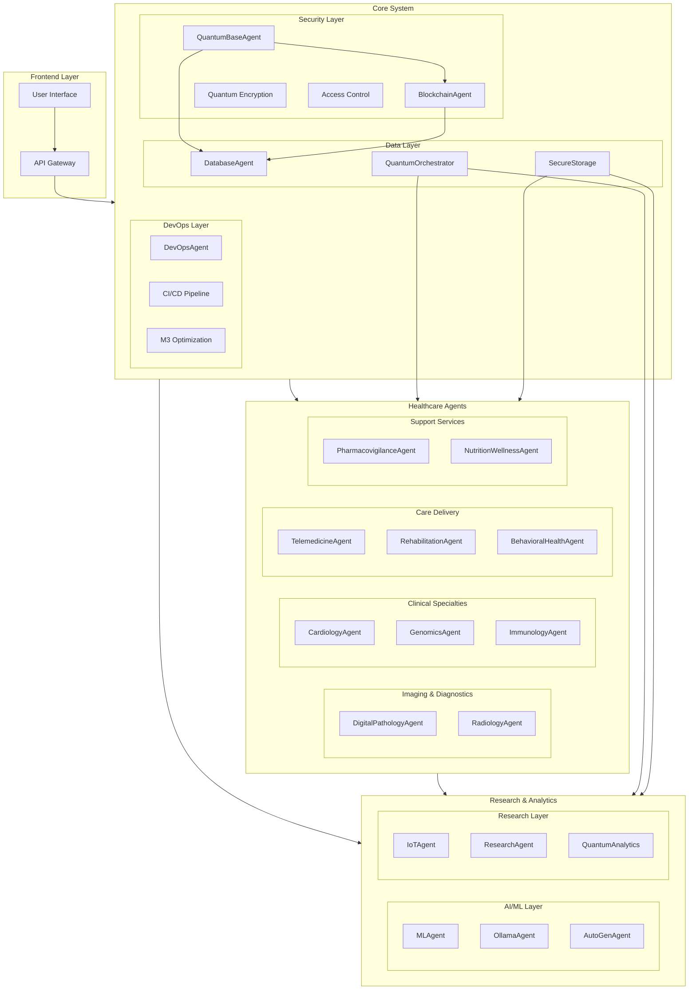
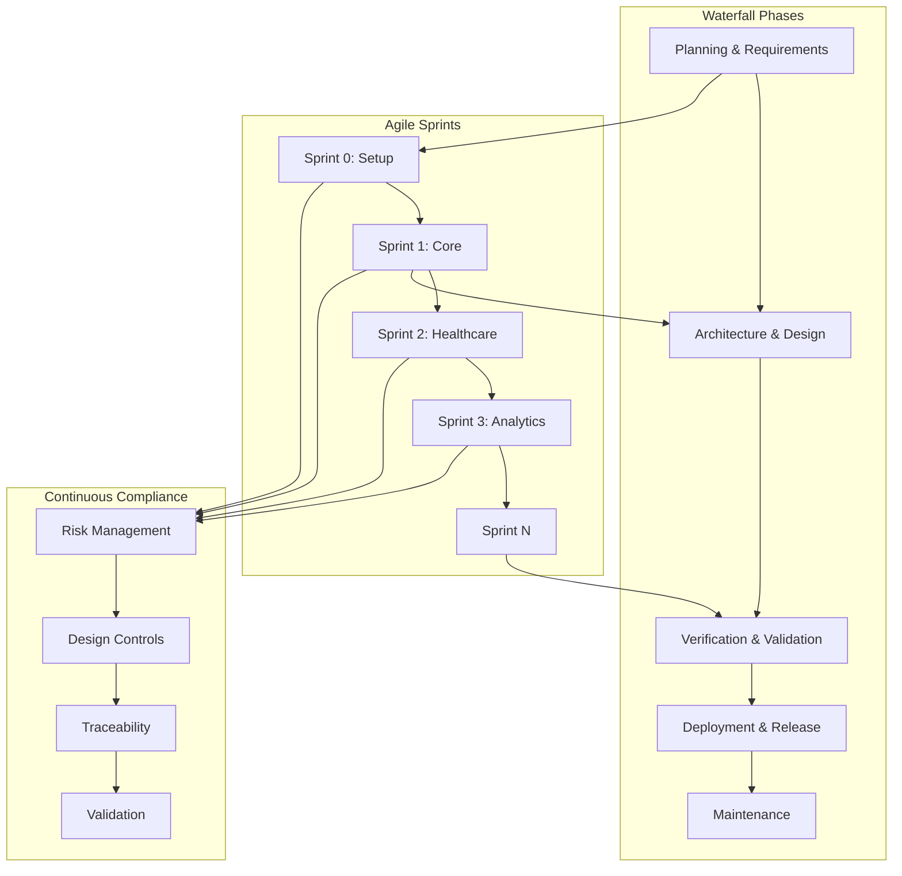
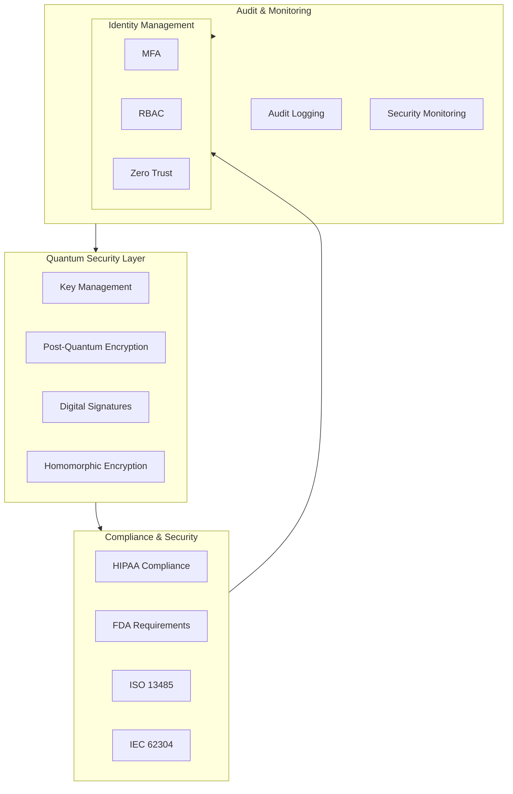
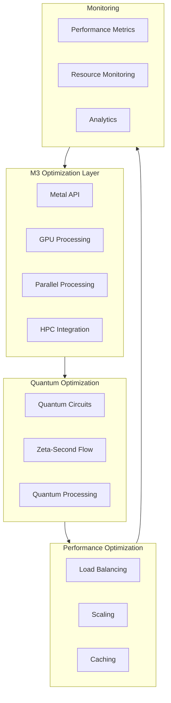

# IQHIS System Overview

## 1. Complete System Architecture

The system architecture represents a comprehensive healthcare information system with quantum-resistant security features and specialized healthcare agents.

### Key Components:

1. **Frontend Layer**
   - `UI`: Modern web interface for healthcare professionals
   - `API Gateway`: Central entry point for all client-server communication

2. **Core System**
   - **Security Layer**
     - `QuantumBaseAgent`: Manages quantum-resistant cryptography
     - `BlockchainAgent`: Handles distributed ledger operations
     - `Quantum Encryption`: Implements post-quantum encryption
     - `Access Control`: Manages authentication and authorization

   - **Data Layer**
     - `DatabaseAgent`: Manages data persistence
     - `SecureStorage`: Handles encrypted data storage
     - `QuantumOrchestrator`: Coordinates quantum operations

   - **DevOps Layer**
     - `DevOpsAgent`: Manages infrastructure
     - `CI/CD Pipeline`: Handles continuous integration/deployment
     - `M3 Optimization`: Implements Metal API optimizations

3. **Healthcare Agents**
   - **Imaging & Diagnostics**
     - `DigitalPathologyAgent`: Processes pathology images
     - `RadiologyAgent`: Handles radiological imaging

   - **Clinical Specialties**
     - `CardiologyAgent`: Manages cardiac data
     - `GenomicsAgent`: Processes genomic information
     - `ImmunologyAgent`: Handles immunology data

   - **Care Delivery**
     - `TelemedicineAgent`: Manages remote consultations
     - `RehabilitationAgent`: Tracks rehabilitation progress
     - `BehavioralHealthAgent`: Handles mental health data

   - **Support Services**
     - `PharmacovigilanceAgent`: Monitors drug safety
     - `NutritionWellnessAgent`: Manages nutrition data

4. **Research & Analytics**
   - **AI/ML Layer**
     - `MLAgent`: Handles machine learning operations
     - `OllamaAgent`: Manages local LLM operations
     - `AutoGenAgent`: Coordinates multi-agent AI tasks

   - **Research Layer**
     - `IoTAgent`: Manages IoT device data
     - `ResearchAgent`: Handles research protocols
     - `QuantumAnalytics`: Processes quantum computations

## 2. Development Methodology

This diagram illustrates our hybrid approach combining Waterfall and Agile methodologies.

### Methodology Components:

1. **Waterfall Phases**
   - `Planning & Requirements`: Initial project setup and requirements gathering
   - `Architecture & Design`: System architecture and detailed design
   - `Verification & Validation`: Comprehensive system testing
   - `Deployment & Release`: Production deployment
   - `Maintenance`: Ongoing system maintenance

2. **Agile Sprints**
   - `Sprint 0`: Environment setup and initial configuration
   - `Sprint 1`: Core system implementation
   - `Sprint 2`: Healthcare agent development
   - `Sprint 3`: Analytics integration
   - `Sprint N`: Ongoing development

3. **Continuous Compliance**
   - `Risk Management`: Ongoing risk assessment
   - `Design Controls`: FDA-compliant design process
   - `Traceability`: Requirements tracking
   - `Validation`: Continuous validation

## 3. Security Architecture

The security architecture ensures quantum-resistant protection and regulatory compliance.

### Security Components:

1. **Quantum Security Layer**
   - `Key Management`: Quantum-safe key generation and storage
   - `Post-Quantum Encryption`: Future-proof encryption
   - `Digital Signatures`: Quantum-resistant signatures
   - `Homomorphic Encryption`: Encrypted data processing

2. **Compliance & Security**
   - `HIPAA Compliance`: Healthcare data protection
   - `FDA Requirements`: Medical device compliance
   - `ISO 13485`: Quality management
   - `IEC 62304`: Medical software lifecycle

3. **Identity Management**
   - `MFA`: Multi-factor authentication
   - `RBAC`: Role-based access control
   - `Zero Trust`: Zero trust architecture

4. **Audit & Monitoring**
   - `Audit Logging`: Comprehensive audit trails
   - `Security Monitoring`: Real-time security monitoring
   - `Incident Management`: Security incident response

## 4. Performance Architecture

The performance architecture focuses on optimization and monitoring.

### Performance Components:

1. **M3 Optimization Layer**
   - `Metal API`: Low-level hardware acceleration
   - `GPU Processing`: GPU-based computation
   - `Parallel Processing`: Multi-threaded operations
   - `HPC Integration`: High-performance computing

2. **Quantum Optimization**
   - `Quantum Circuits`: Quantum algorithm implementation
   - `Zeta-Second Flow`: Ultra-fast quantum operations
   - `Quantum Processing`: Quantum computation management

3. **Performance Optimization**
   - `Load Balancing`: Request distribution
   - `Scaling`: Automatic scaling
   - `Caching`: Multi-level caching

4. **Monitoring**
   - `Performance Metrics`: System performance tracking
   - `Resource Monitoring`: Resource usage monitoring
   - `Analytics`: Performance analytics 