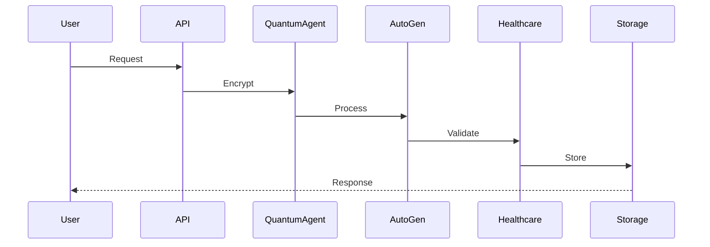

# IQHIS System Architecture Overview

## 1. System Status Dashboard

### Core Components
- ✅ Quantum Base Agent
- ✅ AutoGen Coordinator
- ✅ Healthcare Simulation API
- ⏳ IOTA Integration
- 🔲 NFT System

### Infrastructure
- ✅ CI/CD Pipeline
- ✅ Docker Configuration
- ⏳ Monitoring System
- ✅ Security Layer

### Healthcare Features
- ✅ Simulation Engine
- ✅ Protocol Validation
- ⏳ Clinical Agents
- 🔲 Remote Care

## 2. Architecture Components

### Quantum Layer
- **QuantumBaseAgent**: Core quantum-resistant operations
- **Key Distribution**: Post-quantum cryptography
- **Quantum Circuits**: Zeta-second implementation
- **M3 Optimization**: Hardware acceleration

### AutoGen Layer
- **Model Selection**: Dynamic switching between models
- **Healthcare Agents**: Specialized medical processing
- **Security**: Quantum-safe authentication
- **Compliance**: HIPAA/GDPR enforcement

### Healthcare Layer
- **Simulation**: Medical scenario processing
- **Validation**: Protocol verification
- **Clinical Agents**: Specialty-specific processing
- **Data Protection**: PHI security

### Infrastructure Layer
- **Docker**: Container orchestration
- **CI/CD**: Automated deployment
- **Monitoring**: System health tracking
- **Security**: Quantum-resistant measures

## 3. Data Flow Architecture

## 4. Security Architecture

### Quantum-Resistant Features
- Post-quantum cryptography
- Quantum key distribution
- Secure random number generation
- Quantum-safe digital signatures

### Compliance Measures
- HIPAA compliance
- GDPR requirements
- FDA guidelines
- Audit logging

## 5. Development Workflow

### Zeta-Second Development Cycle
1. Day Q₁: Infrastructure & Security
2. Day Q₂: Healthcare Integration
3. Day Q₃: Testing & Validation
4. Day Q₄: Optimization
5. Day Q₅: Deployment
6. Day Q₆: Review & Planning

### CI/CD Pipeline
- Automated testing
- Security scanning
- Deployment verification
- Performance monitoring

## 6. Future Roadmap

### Phase 1: Core Enhancement
- ⏳ Complete IOTA integration
- 🔲 Implement NFT system
- ⏳ Enhance monitoring

### Phase 2: Feature Expansion
- 🔲 Remote care modules
- 🔲 Advanced analytics
- 🔲 ML model optimization

### Phase 3: Scale & Optimize
- 🔲 Global deployment
- 🔲 Performance tuning
- 🔲 Advanced security

## 7. Implementation Status

### Current Sprint Focus
- Quantum-resistant security implementation
- Healthcare agent optimization
- Monitoring system setup
- Documentation updates

### Next Sprint Planning
- IOTA integration completion
- NFT system implementation
- Remote care module development
- Advanced analytics integration

## 8. Contact & Support

- Technical Lead: [Contact]
- Security Team: [Contact]
- Compliance Officer: [Contact]
- Development Team: [Contact] 