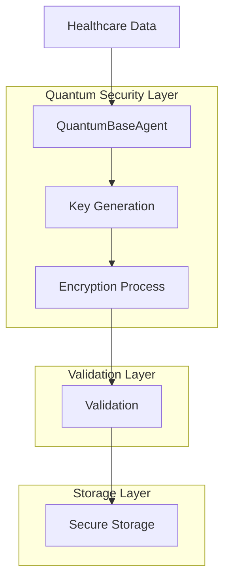

# Quantum-Safe Encryption Operation

## Operation Overview

### Basic Information
- **Operation ID**: QSE-001
- **Operation Name**: Healthcare Data Quantum-Safe Encryption
- **Type**: Security
- **Risk Level**: High
- **Regulatory Impact**: Yes

### Description
This operation implements quantum-safe encryption for healthcare data using the Kyber1024 algorithm, ensuring protection against both classical and quantum computing attacks. It is designed to meet HIPAA compliance requirements while maintaining high performance through M3 optimization.

## Technical Details

### Architecture Components


### Dependencies
- **Required Services**
  - QuantumBaseAgent
  - Key Management Service
  - Secure Storage Service
  - Audit Logging Service

- **External APIs**
  - None (all operations performed locally)

- **Libraries**
  - `pqcrypto-kyber`
  - `quantum-safe-crypto`
  - `m3-crypto-opt`

- **Infrastructure**
  - M3-optimized compute nodes
  - Hardware Security Module (HSM)
  - Secure key storage

### Security Considerations
- **Authentication**: Multi-factor authentication required
- **Authorization**: Role-based access control (RBAC)
- **Data Protection**: 
  - At-rest encryption using Kyber1024
  - In-transit encryption using quantum-safe TLS
- **Quantum-Safe Requirements**:
  - Key size: 1024 bits
  - Post-quantum cryptography ready
  - Regular key rotation

## Implementation

### Code Reference
```python
from iqhis.security import QuantumBaseAgent
from iqhis.crypto import Kyber1024
from iqhis.validation import DataValidator

class HealthcareEncryption:
    def __init__(self):
        self.qba = QuantumBaseAgent()
        self.crypto = Kyber1024()
        self.validator = DataValidator()
    
    async def encrypt_phi(self, data: dict) -> tuple:
        """
        Encrypt Protected Health Information (PHI)
        
        Args:
            data (dict): Healthcare data to encrypt
            
        Returns:
            tuple: (encrypted_data, key_id)
        """
        # Validate input data
        self.validator.validate_phi(data)
        
        # Generate quantum-safe keys
        key_pair = await self.qba.generate_key_pair()
        
        # Encrypt data
        encrypted_data = self.crypto.encrypt(
            data=data,
            public_key=key_pair.public_key
        )
        
        # Store key securely
        key_id = await self.qba.store_key(key_pair.private_key)
        
        return encrypted_data, key_id
```

### Configuration
```yaml
quantum_encryption:
  algorithm: Kyber1024
  key_rotation_hours: 24
  performance:
    m3_optimization: true
    batch_size: 100
  security:
    mfa_required: true
    audit_logging: true
    key_backup: true
```

## Validation

### Test Requirements
- **Unit Tests**
  - Key generation
  - Encryption/decryption
  - Error handling
  - Input validation

- **Integration Tests**
  - End-to-end encryption flow
  - Key management integration
  - Storage integration
  - Audit logging

- **Performance Tests**
  - Encryption speed
  - Key generation time
  - Memory usage
  - M3 optimization validation

- **Security Tests**
  - Quantum resistance validation
  - Key strength verification
  - Side-channel attack prevention
  - Access control testing

### Compliance Checks
- **HIPAA Requirements**
  - PHI protection verification
  - Access control validation
  - Audit trail completeness
  - Breach notification readiness

- **FDA Validation**
  - Software validation
  - Risk management
  - Documentation completeness
  - Change control process

- **ISO 13485 Controls**
  - Quality management system
  - Risk management process
  - Documentation control
  - Validation records

- **IEC 62304 Requirements**
  - Software lifecycle processes
  - Risk management
  - Configuration management
  - Problem resolution

## Risk Management

### FMEA Analysis
| Risk | Severity | Probability | Detection | RPN | Mitigation |
|------|----------|-------------|-----------|-----|------------|
| Key Compromise | 5 | 1 | 2 | 10 | Regular key rotation, secure storage |
| Encryption Failure | 5 | 1 | 1 | 5 | Redundant systems, failure monitoring |
| Performance Degradation | 3 | 2 | 1 | 6 | M3 optimization, performance monitoring |
| Data Loss | 5 | 1 | 1 | 5 | Backup systems, validation checks |

### Control Measures
- **Preventive Controls**
  - Input validation
  - Access controls
  - Key rotation
  - Security hardening

- **Detective Controls**
  - Real-time monitoring
  - Audit logging
  - Performance metrics
  - Security scanning

- **Corrective Actions**
  - Automated failover
  - Incident response
  - Recovery procedures
  - Root cause analysis

## Performance

### Metrics
- **Response Time**
  - Key generation: < 100ms
  - Encryption: < 50ms/record
  - Decryption: < 50ms/record

- **Resource Usage**
  - CPU: < 30%
  - Memory: < 1GB
  - Storage: Based on data volume

- **Error Rate**
  - Target: < 0.001%
  - Monitoring: Real-time
  - Alerting: > 0.0005%

### Optimization
- **M3 Optimizations**
  - Hardware acceleration
  - Parallel processing
  - Memory optimization
  - Cache utilization

- **Caching Strategy**
  - Key caching
  - Result caching
  - Configuration caching
  - Session caching

## Maintenance

### Routine Tasks
- Daily key rotation
- Weekly performance review
- Monthly security assessment
- Quarterly compliance audit

### Troubleshooting
- **Common Issues**
  1. Key rotation failures
  2. Performance degradation
  3. Integration errors
  4. Compliance alerts

- **Resolution Steps**
  1. Check system logs
  2. Verify configurations
  3. Test key operations
  4. Validate security controls

## Documentation History

### Version Control
| Version | Date | Author | Changes | Approved By |
|---------|------|---------|----------|-------------|
| 1.0.0 | 2024-03-21 | Security Team | Initial version | Security Officer |
| 1.0.1 | 2024-03-22 | DevOps Team | M3 optimization updates | Technical Lead |

### Related Documents
- Quantum Security Architecture
- Key Management Procedures
- Compliance Documentation
- Performance Specifications

## Appendix

### References
- NIST Post-Quantum Cryptography Standards
- HIPAA Security Rule Requirements
- M3 Optimization Guidelines
- Key Management Best Practices

### Attachments
- Security Architecture Diagrams
- Performance Benchmark Reports
- Compliance Certificates
- Training Materials 