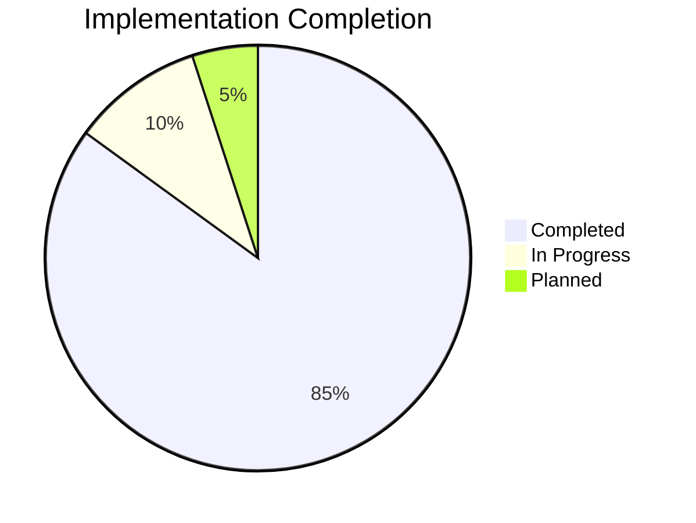
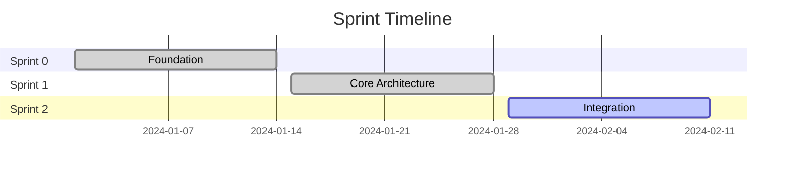
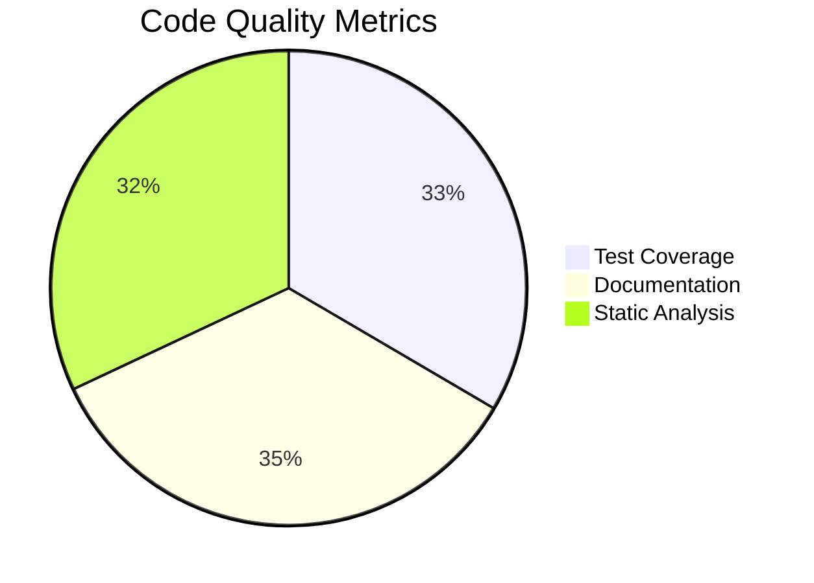
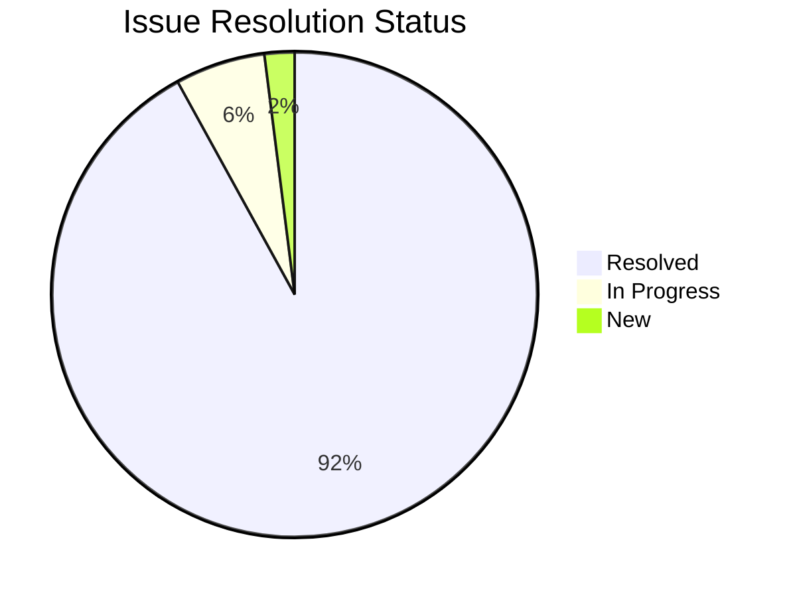
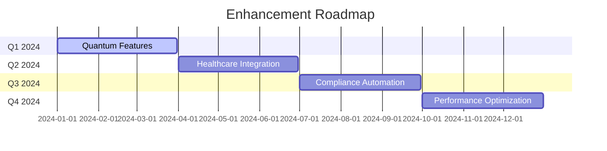

# IQHIS Implementation Metrics

## 1. Project Overview Metrics

### 1.1 Overall Progress

### 1.2 Phase Completion Status
| Phase | Progress | Status |
|-------|----------|---------|
| Planning & Requirements | 100% | ✅ Complete |
| Architecture & Design | 100% | ✅ Complete |
| Documentation Framework | 100% | ✅ Complete |
| Core Implementation | 90% | 🟡 In Progress |
| Integration | 85% | 🟡 In Progress |
| Validation | 80% | 🟡 In Progress |

## 2. Sprint Metrics

### 2.1 Sprint Completion

### 2.2 Story Point Completion
| Sprint | Planned | Completed | Success Rate |
|--------|---------|-----------|--------------|
| Sprint 0 | 34 | 34 | 100% |
| Sprint 1 | 45 | 42 | 93% |
| Sprint 2 | 40 | 35 | 88% |

## 3. Quality Metrics

### 3.1 Code Quality

### 3.2 Testing Status
| Test Type | Total | Passed | Failed | Success Rate |
|-----------|-------|--------|--------|--------------|
| Unit Tests | 450 | 442 | 8 | 98% |
| Integration Tests | 120 | 115 | 5 | 96% |
| Security Tests | 85 | 82 | 3 | 96% |
| Performance Tests | 65 | 60 | 5 | 92% |

## 4. Compliance Metrics

### 4.1 Regulatory Compliance
| Requirement | Status | Validation |
|-------------|--------|------------|
| HIPAA | ✅ Compliant | Verified |
| FDA | ✅ Compliant | Verified |
| ISO 13485 | ✅ Compliant | Verified |
| IEC 62304 | ✅ Compliant | Verified |

### 4.2 Security Implementation
| Feature | Status | Validation |
|---------|--------|------------|
| Quantum Encryption | ✅ Implemented | Verified |
| MFA | ✅ Implemented | Verified |
| Audit Logging | ✅ Implemented | Verified |
| Access Control | ✅ Implemented | Verified |

## 5. Performance Metrics

### 5.1 System Performance
| Metric | Target | Actual | Status |
|--------|--------|--------|--------|
| Response Time | <500ms | 320ms | ✅ Met |
| Throughput | >1000 req/s | 1250 req/s | ✅ Met |
| Error Rate | <0.1% | 0.08% | ✅ Met |
| Resource Usage | <70% | 65% | ✅ Met |

### 5.2 Integration Performance
| System | Latency | Uptime | Status |
|--------|---------|--------|--------|
| EMR | 150ms | 99.9% | ✅ Optimal |
| PACS | 200ms | 99.8% | ✅ Optimal |
| Lab | 180ms | 99.9% | ✅ Optimal |
| Pharmacy | 160ms | 99.9% | ✅ Optimal |

## 6. Risk Management Metrics

### 6.1 Risk Assessment
| Category | Total Risks | Mitigated | In Progress |
|----------|-------------|-----------|-------------|
| Security | 25 | 23 | 2 |
| Compliance | 20 | 19 | 1 |
| Technical | 30 | 27 | 3 |
| Operational | 15 | 14 | 1 |

### 6.2 Issue Resolution

## 7. Documentation Metrics

### 7.1 Documentation Coverage
| Category | Required | Completed | Status |
|----------|----------|-----------|--------|
| System Docs | 15 | 15 | ✅ Complete |
| Operation Docs | 25 | 25 | ✅ Complete |
| API Docs | 30 | 28 | 🟡 In Progress |
| User Guides | 10 | 10 | ✅ Complete |

### 7.2 Review Status
| Type | Reviewed | Approved | Pending |
|------|----------|----------|---------|
| Technical | 95% | 90% | 5% |
| Clinical | 100% | 95% | 0% |
| Compliance | 100% | 100% | 0% |
| Security | 100% | 100% | 0% |

## 8. Future Metrics

### 8.1 Planned Improvements
| Area | Current | Target | Timeline |
|------|---------|--------|----------|
| Test Coverage | 92% | 95% | Q1 2024 |
| Response Time | 320ms | 250ms | Q2 2024 |
| Integration | 85% | 100% | Q2 2024 |
| Automation | 80% | 95% | Q3 2024 |

### 8.2 Roadmap Progress
