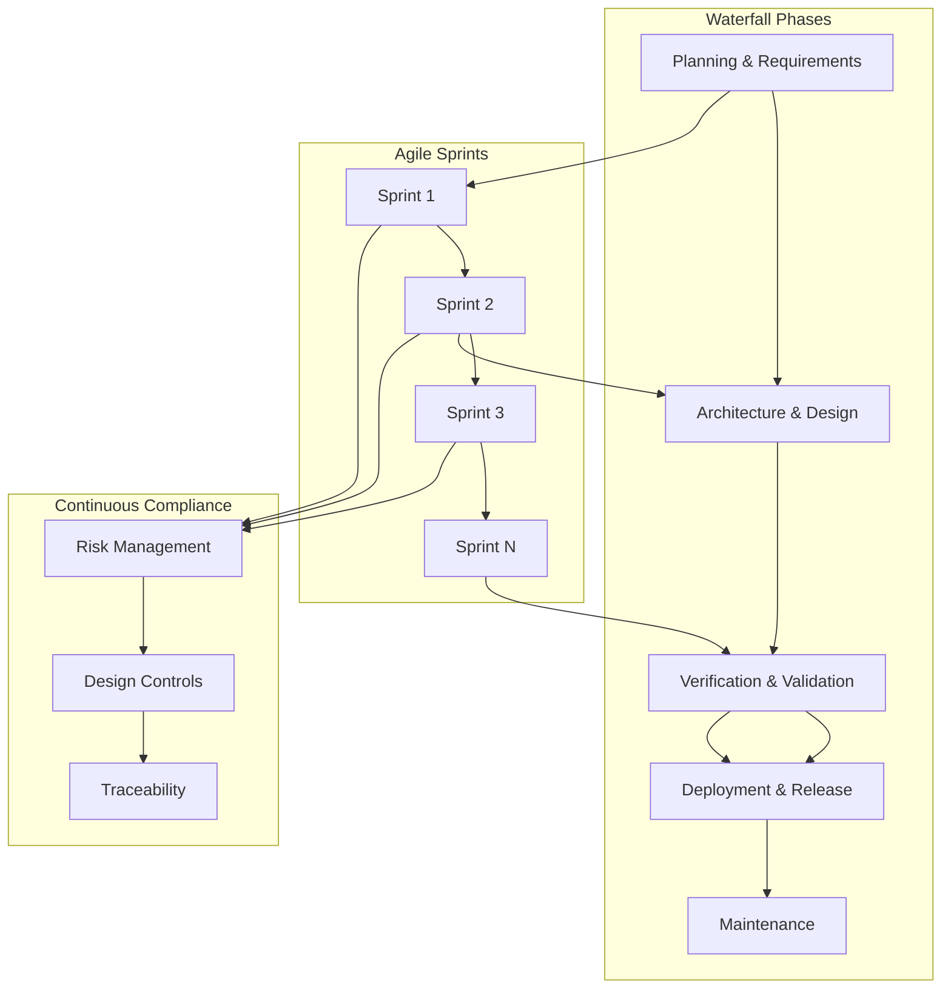

# Overall Hybrid Agile-Waterfall System Flow

## Introduction

The Integrated Quantum-Resistant Healthcare Information System (IQHIS) implements a hybrid development methodology that combines the rigorous compliance requirements of Waterfall with the flexibility and rapid feedback cycles of Agile. This approach ensures adherence to healthcare regulations (ISO 13485, IEC 62304) while maintaining development agility and responsiveness to stakeholder needs.

### Why Hybrid?
- **Regulatory Compliance**: Waterfall phases provide structured checkpoints for design controls and risk management
- **Rapid Iteration**: Agile sprints enable quick feedback and continuous improvement
- **Risk Management**: Continuous risk assessment throughout development cycles
- **Traceability**: End-to-end requirement tracking from conception to deployment

## System Flow Diagram

## Detailed Phase Breakdown

### 1. Planning & Requirements (Waterfall)

#### Key Activities
- Stakeholder Interviews & Alignment
  - Clinical workflow analysis
  - Technical requirements gathering
  - Regulatory compliance planning
  
#### Deliverables
- Requirements Specification Document
- Initial Risk Analysis (FMEA/HAZOP)
- Design Controls Setup
- Regulatory Strategy Document

[→ See Design Controls Template](../design_controls/design_control_template.md)

### 2. Architecture & High-Level Design (Waterfall)

#### Key Activities
- System Architecture Design
  - UML and block diagrams
  - Quantum-safe security layers
  - M3 optimization patterns
  
#### Deliverables
- System Architecture Document
- Data Flow Diagrams
- Agent Specifications
- Initial Traceability Matrix

[→ See System Architecture Guide](../architecture/system_architecture.md)

### 3. Iterative Development (Agile)

#### Sprint Structure
- Duration: 2-4 weeks
- Daily Stand-ups
- Sprint Planning
- Sprint Review
- Sprint Retrospective

#### Continuous Activities
- Code Development
- Unit Testing
- Integration Testing
- Documentation Updates
- Risk Assessment Updates

[→ See Sprint Process Guide](../process/agile/sprint_process.md)

### 4. Verification & Validation (Hybrid)

#### Verification Activities
- Design Review
- System Integration Testing
- Performance Testing
- Security Testing

#### Validation Activities
- User Acceptance Testing
- Clinical Validation
- Regulatory Documentation
- Compliance Verification

[→ See V&V Framework](../validation/validation_framework.md)

### 5. Deployment & Release (Waterfall)

#### Key Steps
- Infrastructure Setup
  - IaC deployment
  - Environment configuration
  - Security hardening
  
#### Release Process
- Blue-Green Deployment
- Canary Testing
- Production Release
- Documentation Finalization

[→ See Deployment Guide](../deployment/deployment_guide.md)

## Healthcare-Specific Considerations

### Risk Management
- Continuous risk assessment
- FMEA/HAZOP updates
- Security threat modeling
- Clinical safety analysis

### Regulatory Compliance
- ISO 13485 adherence
- IEC 62304 compliance
- FDA guidelines alignment
- HIPAA requirements

### Design Controls
- Requirements traceability
- Change management
- Document version control
- Validation records

## Integration Points

### Waterfall-Agile Integration
1. Sprint outcomes feed into Waterfall checkpoints
2. Risk updates influence sprint planning
3. Design controls evolve with sprint deliverables
4. Continuous validation throughout sprints

### Quality Gates
1. Code quality metrics
2. Test coverage requirements
3. Documentation completeness
4. Regulatory compliance checks

## Next Steps

1. Review [System Architecture](../architecture/system_architecture.md)
2. Configure [CI/CD Pipeline](../tools/ci_cd/pipeline_template.yml)
3. Set up [Development Environment](../setup/environment_setup.md)
4. Begin [Sprint Planning](../process/agile/sprint_planning.md)

## References

- [Design Controls Documentation](../design_controls/design_control_template.md)
- [Regulatory Requirements](../regulatory/requirements.md)
- [Sprint Process Guide](../process/agile/sprint_process.md)
- [Validation Framework](../validation/validation_framework.md) 