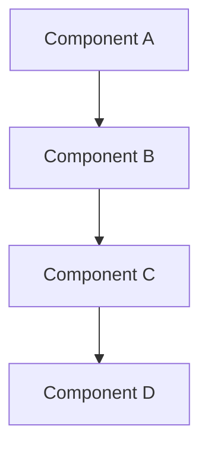

# Operation Documentation Template

## Operation Overview

### Basic Information
- **Operation ID**: [Unique identifier]
- **Operation Name**: [Name]
- **Type**: [e.g., Healthcare, Security, Integration]
- **Risk Level**: [High/Medium/Low]
- **Regulatory Impact**: [HIPAA/FDA/ISO/etc.]

### Description
[Detailed description of the operation's purpose and functionality]

## Technical Details

### Architecture Components


### Dependencies
- Required Services
- External APIs
- Libraries
- Infrastructure Components

### Security Considerations
- Authentication Requirements
- Authorization Requirements
- Data Protection Measures
- Quantum-Safe Requirements

## Implementation

### Code Reference
```python
# Example code or pseudocode
def operation_example():
    # Implementation details
    pass
```

### Configuration
```yaml
# Configuration example
operation:
  name: example
  type: healthcare
  security:
    quantum_resistant: true
    encryption_level: high
```

## Validation

### Test Requirements
- Unit Tests
- Integration Tests
- Performance Tests
- Security Tests

### Compliance Checks
- HIPAA Requirements
- FDA Validation
- ISO 13485 Controls
- IEC 62304 Requirements

## Risk Management

### FMEA Analysis
| Risk | Severity | Probability | Detection | RPN | Mitigation |
|------|----------|-------------|-----------|-----|------------|
| Risk 1 | S | P | D | RPN | Strategy |

### Control Measures
- Preventive Controls
- Detective Controls
- Corrective Actions
- Monitoring Requirements

## Performance

### Metrics
- Response Time
- Resource Usage
- Error Rate
- Throughput

### Optimization
- M3 Optimizations
- Caching Strategy
- Load Balancing
- Resource Management

## Maintenance

### Routine Tasks
- Health Checks
- Backup Procedures
- Update Process
- Monitoring Setup

### Troubleshooting
- Common Issues
- Resolution Steps
- Escalation Process
- Recovery Procedures

## Documentation History

### Version Control
| Version | Date | Author | Changes | Approved By |
|---------|------|---------|----------|-------------|
| 1.0.0 | YYYY-MM-DD | [Author] | Initial | [Approver] |

### Related Documents
- Design Documents
- Test Plans
- Validation Reports
- Risk Assessments

## Appendix

### References
- Technical Documentation
- Standards Documentation
- Regulatory Guidelines
- Best Practices

### Supporting Materials
- Additional Diagrams
- Test Data Examples
- Configuration Templates
- Validation Checklists 