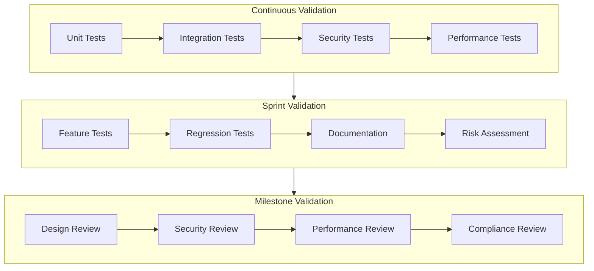

# Validation Framework

## Overview

This framework defines the verification and validation (V&V) processes for healthcare software development, ensuring compliance with regulatory requirements while maintaining agile development practices.

## Validation Strategy

### 1. Continuous Validation

#### Development Phase
- Unit Testing
  - Code coverage requirements
  - Test-driven development
  - Automated test suites

#### Integration Phase
- API Testing
- Component Integration
- System Integration
- Performance Testing

#### Security Validation
- Quantum-Safe Analysis
- Penetration Testing
- Vulnerability Scanning
- Threat Modeling

### 2. Sprint-Based Validation

#### Sprint Activities
- Feature Testing
- Regression Testing
- Documentation Review
- Risk Assessment Updates

#### Sprint Deliverables
- Test Results
- Coverage Reports
- Security Scan Results
- Performance Metrics

### 3. Milestone Validation

#### Design Reviews
- Architecture Review
- Security Review
- Performance Review
- Compliance Review

#### System Validation
- End-to-End Testing
- Load Testing
- Stress Testing
- Recovery Testing

## Verification Methods

### 1. Static Analysis
- Code Quality
- Security Analysis
- Dependency Scanning
- Documentation Review

### 2. Dynamic Analysis
- Runtime Testing
- Memory Analysis
- Performance Profiling
- Security Testing

### 3. Manual Review
- Code Review
- Design Review
- Documentation Review
- Risk Assessment

## Validation Requirements

### 1. Documentation
- Test Plans
- Test Cases
- Test Results
- Validation Reports

### 2. Coverage Requirements
- Code Coverage: 85%
- Requirements Coverage: 100%
- Risk Coverage: 100%
- Security Coverage: 100%

### 3. Performance Requirements
- Response Time
- Throughput
- Resource Usage
- Scalability

## Healthcare-Specific Validation

### 1. Clinical Validation
- User Acceptance Testing
- Clinical Workflow Testing
- Data Accuracy Testing
- Patient Safety Testing

### 2. Regulatory Validation
- ISO 13485 Compliance
- IEC 62304 Compliance
- FDA Requirements
- HIPAA Compliance

### 3. Risk-Based Validation
- FMEA Updates
- HAZOP Analysis
- Risk Controls Testing
- Safety Measures

## Validation Tools

### 1. Automated Testing
- Unit Testing Framework
- Integration Testing Tools
- Performance Testing Suite
- Security Testing Tools

### 2. Continuous Integration
- Build Automation
- Test Automation
- Deployment Automation
- Monitoring Tools

### 3. Documentation Tools
- Requirements Management
- Test Management
- Risk Management
- Document Control

## Validation Process Flow

## Validation Metrics

### 1. Quality Metrics
- Defect Density
- Test Coverage
- Code Quality
- Documentation Quality

### 2. Performance Metrics
- Response Time
- Throughput
- Resource Usage
- Error Rates

### 3. Security Metrics
- Vulnerability Count
- Security Score
- Risk Coverage
- Compliance Score

## Validation Reports

### 1. Sprint Reports
- Test Results
- Coverage Reports
- Security Reports
- Performance Reports

### 2. Milestone Reports
- Validation Summary
- Risk Assessment
- Compliance Status
- Release Readiness

### 3. Release Reports
- System Validation
- Clinical Validation
- Security Validation
- Regulatory Compliance

## References

- [Design Controls](../design_controls/design_control_template.md)
- [Sprint Process](../process/agile/sprint_process.md)
- [CI/CD Pipeline](../tools/ci_cd/pipeline_template.yml)
- [Risk Management](../regulatory/risk_management.md) 